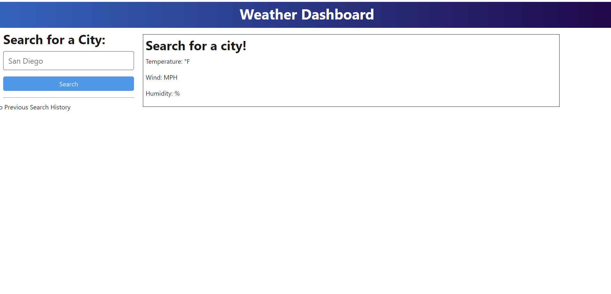
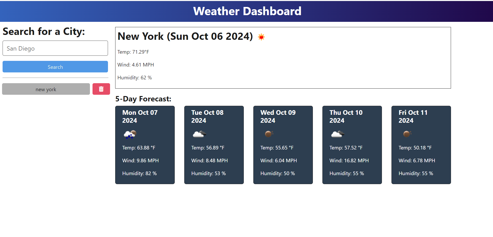

# weatherForcast
## User Story
- AS A traveler.
- I WANT to see the weather outlook for multiple cities.
- SO THAT I can plan a trip accordingly.
## Acceptance Criteria
- GIVEN a weather dashboard with form inputs
- WHEN I search for a city
- THEN I am presented with current and future conditions for that city, and that city is added to the search history
- WHEN I view current weather conditions for that city
- THEN I am presented with the city name, the date, an icon representation of weather conditions, a description of the weather for the icon's `alt` tag, the temperature, the humidity, and the wind speed
- WHEN I view future weather conditions for that city
- THEN I am presented with a 5-day forecast that displays the date, an icon representation of weather conditions, the temperature, the wind speed, and the humidity
- WHEN I click on a city in the search history
- THEN I am again presented with current and future conditions for that city
## Usage
To Use This weatherForcast Application, Please copy that link given in the WEBpage link inside Questions Section and Do the followings:
- Paste that Link in the Browser.
- When Page properly rendered on the screen pls type city name in the search Box.
    
- Then press Search button or Enter.
- As I press button or Enter Im gonna see the page with current weather and next Five days weather on the same page 
    
- The city name searched would be added to the page and I can see that city name below that search Box with delete button on the right side.
- As I click on that saved city name then its gona show the Current and next Five days weather on the same Page.
- If I Click Delete Button then its gona delete that "Saved City" from the Page.    

## license 
- 
## Questions 
- 
- 
- 